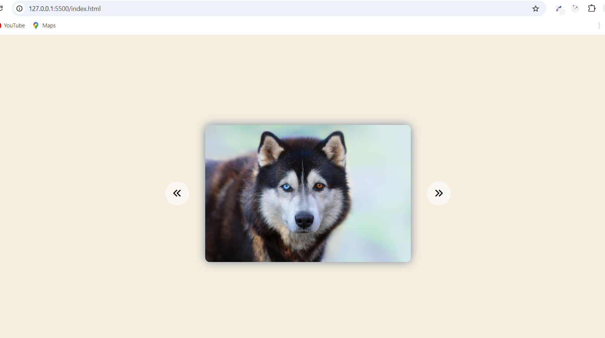
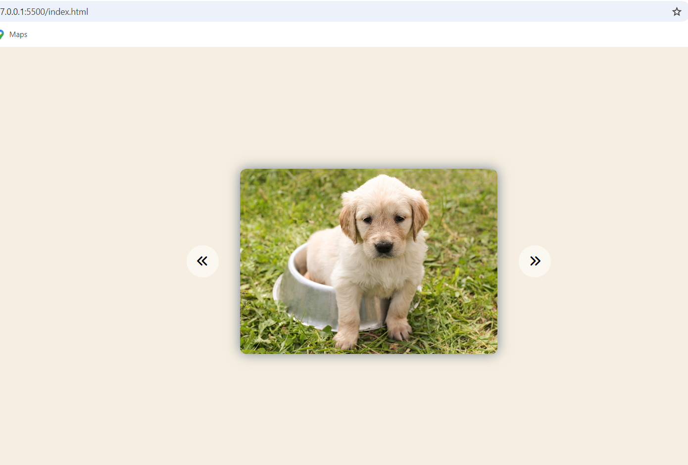
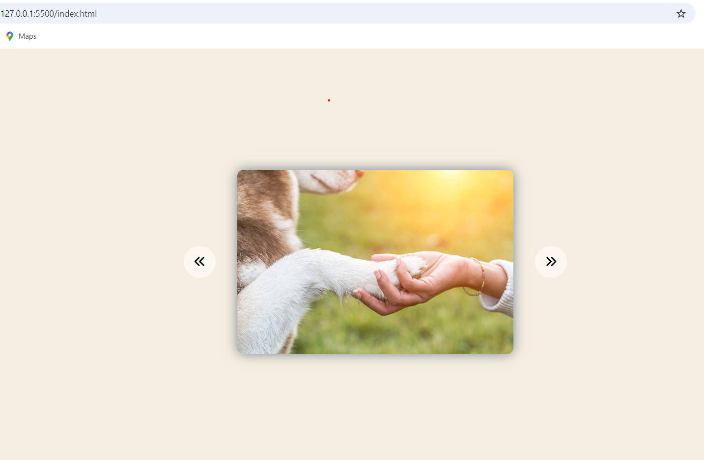

Basic Image Slider
=====================

Image slider built using HTML, CSS, and JavaScript.

Features
--------

* Manual navigation using arrows

Getting Started
---------------

1. Clone the repository.
2. Open the `index.html` file in a browser to run the project.

Customization
-------------

* To change the image sources, update the `images` array in `index.js`.
* To style the slider, add custom CSS to the `index.css` file.

Screenshots
-----------

